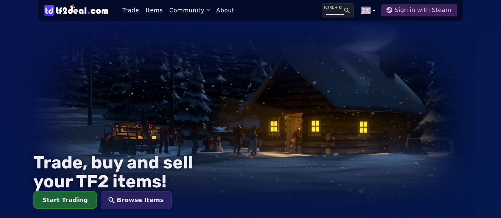
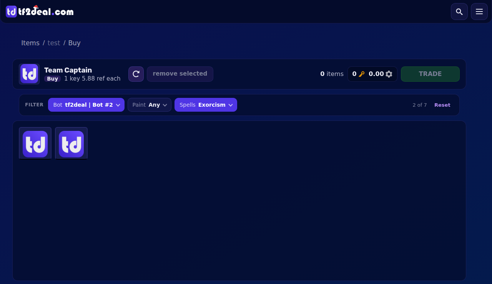
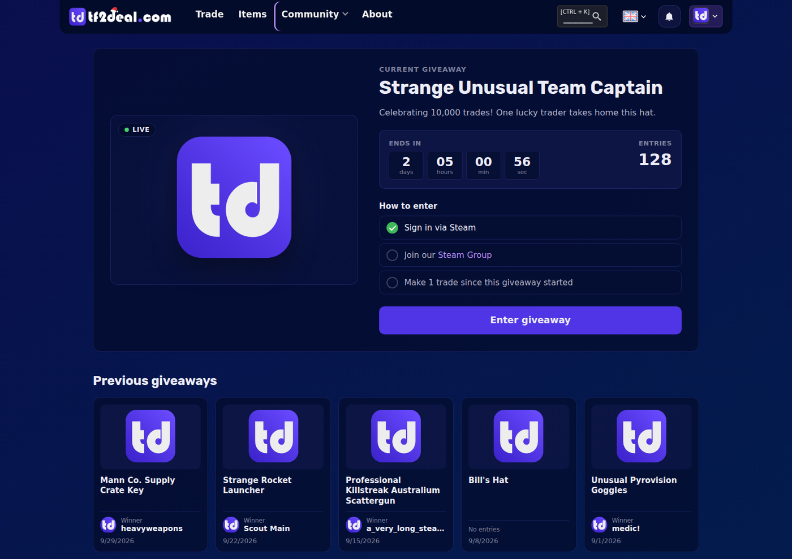
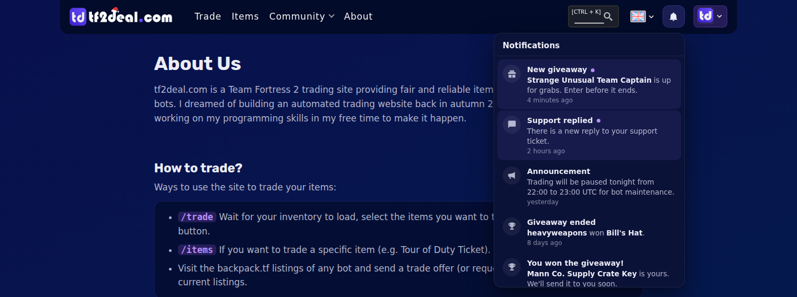
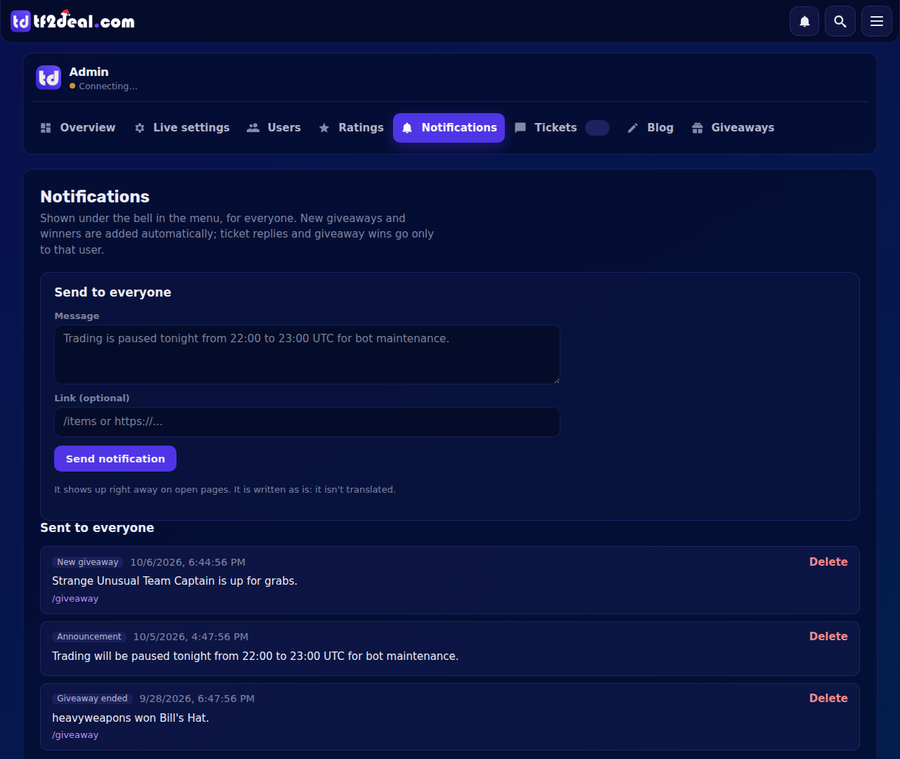
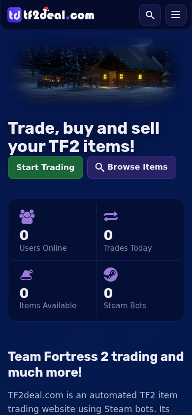
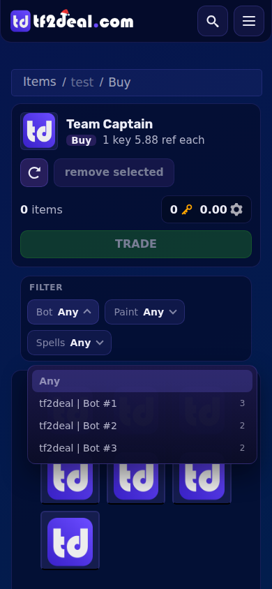
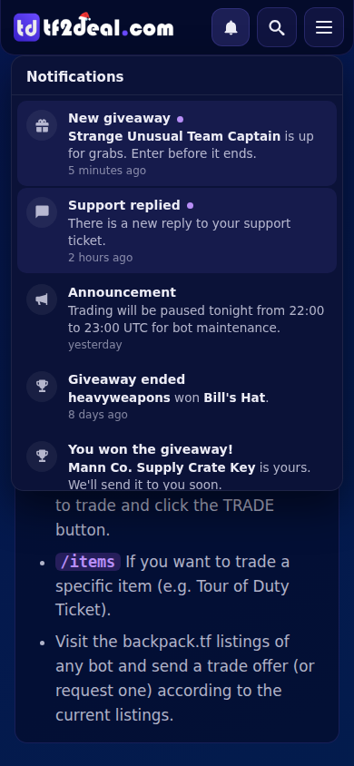
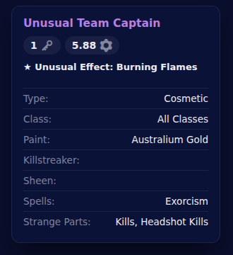

# tf2deal.com

**Trade, buy and sell your TF2 items.** 
An automated Team Fortress 2 trading site: sign in with Steam, pick your items and our trading bots send you an
offer in seconds.

🇬🇧 English · 🇨🇿 Čeština · 🇩🇪 Deutsch · 🇪🇸 Español · 🇫🇷 Français · 🇵🇹 Português · 🇷🇺 Русский · 🇨🇳 中文

 

 

## ✨ Highlights

| | |
|---|---|
| 🔁 **Instant trades** | Pick items from your inventory and ours, and a bot sends the Steam trade offer right away |
| 📡 **Live trade status** | The offer moves from sent to accepted on screen, without reloading the page |
| 🎒 **Item pages** | Buy or sell a single item, with filters for bot, paint, spells, parts and more |
| 🎁 **Giveaways** | Community giveaways with a countdown, entry requirements and a winner drawn automatically |
| 🔔 **Notifications** | A bell for new giveaways, winners, support replies and announcements |
| ⭐ **Ratings** | Traders rate the site after a trade, with a Trustpilot button for happy customers |
| 🌍 **Eight languages** | Every page and URL in 8 languages, with optional AI translation of blog posts |
| 🎛️ **Admin panel** | Users, tickets, blog, giveaways, ratings, notifications and live site settings |
| 🔒 **Secure** | Steam sign-in, server-side admin sessions, rate limits and escaped user data |
| 📱 **Responsive** | Designed for phones, tablets and desktops |

 

## 🖼️ A closer look

<table>
  <tr>
    <td width="50%"> <b>Item page</b>: buy or sell one item, filtered by bot, paint or spells</td>
    <td width="50%"> <b>Giveaways</b>: countdown, requirements and past winners</td>
  </tr>
  <tr>
    <td> <b>Notifications</b>: new giveaways, winners and support replies, live</td>
    <td> <b>Admin panel</b>: send an announcement to everyone in one click</td>
  </tr>
</table>

  
  &nbsp;
  
  &nbsp;
  
   <b>On the phone</b>: the same site, made for thumbs

 

  
   <b>Item details</b>: price, effect, paint, spells and parts at a glance

 

## 🎮 For traders

- **Trade page** with both inventories side by side, filters, search and stacked identical items
- **Item database** with every item we buy and sell, and a page for each one
- **Live updates** while the bot prepares, sends and completes the offer
- **Profile** with trade history, wishlist, giveaway entries and support tickets
- **Giveaways** anyone with an account can enter
- **Blog** with news and guides
- **Cookie consent** and clear legal pages

## 🧑‍💼 For the site owner

- **Overview** of users online, trades today, open tickets and the average rating
- **Live settings**: pause trading, show an announcement banner or blacklist items, applied instantly
- **Users**: change roles or block an account
- **Tickets, blog and giveaways** managed from one place
- **Notifications** sent to every signed-in user
- **Other apps** can change settings live over a socket (see [SETTINGS.md](SETTINGS.md))

## 🧱 Built with

| Layer | Technology |
|---|---|
| Pages | EJS templates, Sass, plain JavaScript |
| Server | Node.js, Express 4 |
| Database | MongoDB with Mongoose |
| Live updates | Socket.IO |
| Sign-in | Steam OpenID (Passport) |
| Translations | 8 languages, optional AI translation (Cloudflare Workers AI or Claude) |
| Security | Server-side sessions, rate limiting, security headers, escaped output, constant-time secret checks |

 

## 🚀 Getting started

The site needs Node.js, a MongoDB database, a Steam Web API key and the tf2deal bot server.

Installation, settings and the admin login are explained in **[docs/SETUP.md](docs/SETUP.md)**.
Putting it on an Ubuntu server straight from GitHub is in **[docs/UBUNTU.md](docs/UBUNTU.md)**.
Everything that changed, round by round, is in **[CHANGES.md](CHANGES.md)**.

 

## 👤 Author

Designed and built by **Nikolas Malík**. 
🌐 [malikweb.eu](https://malikweb.eu) · GitHub [@GeronimoCZE](https://github.com/GeronimoCZE)

## 📄 License

© 2026 Nikolas Malík. All rights reserved.
